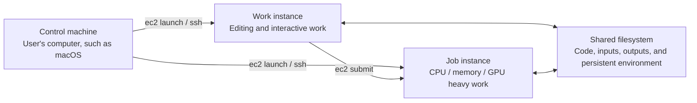

# ec2

ec2 is a small AWS EC2 management command for using different EC2 instances
for different kinds of work.

It is designed for a setup with three roles:



- **Control machine**: the user's local machine, such as macOS. It is the
  main origin for managing EC2 with ec2.
- **Work instance**: a small, usually persistent instance such as t3.medium
  for editing, interactive development, and sometimes Claude or Codex.
- **Job instance**: a temporary instance chosen for the workload, such as
  r8i.4xlarge, g4dn.4xlarge, or c8i.large. It keeps heavy work from exhausting
  the work instance and is normally terminated afterwards.

When the AMI and shared filesystem are configured consistently, a job instance
can provide the same working environment as the work instance while offering
more suitable vCPUs, memory, or GPUs. A job can be submitted from either the
control machine or the work instance. See [Use cases and architecture](docs/use-cases.md).

## Requirements

- [AWS CLI](https://aws.amazon.com/cli/)
- [Packer](https://developer.hashicorp.com/packer) for make_ami
- An AWS account, region, network, IAM permissions, and SSH/SSM access
- A shared filesystem such as EFS or FSx when sharing files between instances

## Installation

Use Homebrew:

```sh
brew install rcmdnk/rcmdnkpac/ec2
```

Alternatively, put [bin/ec2](bin/ec2) anywhere in PATH. In that case, install
the AWS CLI separately.

Or install the released command with [mise](https://mise.jdx.dev/) using its
GitHub backend:

```sh
mise use -g 'github:rcmdnk/ec2[asset_pattern=ec2,bin=ec2]@latest'
```

Releases are created automatically when a version tag such as v0.3.1 is pushed.
The release asset is the generated bin/ec2 command.

## Getting started

Create and edit the environment configuration:

```sh
ec2 init_environment
$EDITOR ~/.config/ec2/environment
```

Set the AWS, AMI, network, and shared filesystem settings you need. Then build
the AMI and generate the launch configuration:

```sh
ec2 make_ami --setup
```

Launch a small work instance and connect to it:

```sh
ec2 launch -t t3.medium
ec2 ssh
```

For a substantial test, build, analysis, or other CPU-, memory-, or
GPU-intensive task, keep its code, inputs, and outputs on the shared
filesystem and submit it to a suitable job instance:

```sh
cd /mnt/fsx/jobs/my-job
ec2 submit -t c8i.large --submit-current-dir 1 ./run.sh
```

ec2 submit waits for the instance, runs the script or command, and terminates
the instance after completion by default. Choose the instance type from the
workload's bottleneck: vCPUs for CPU-heavy work, memory for in-memory work,
and a compatible GPU AMI and GPU type for GPU work.

## Documentation

- [Use cases and architecture](docs/use-cases.md): roles, workflows, when to
  use submit, and initial dotfiles migration and verification
- [User guide](docs/user-guide.md): configuration, AMIs, lifecycle, connections,
  file transfer, shared filesystems, jobs, and image management
- [AI tools and ec2-operator](docs/ai-tools.md): Codex and Claude Code setup,
  prompts, and skill invocation
- [Shell completion](docs/shell-completion.md): Bash and zsh completion setup
- [Environment setup](docs/environment-setup.md): AWS prerequisites,
  permissions, filesystem setup, AMI builds, and cleanup details

## Help

Run ec2 help for the complete list of subcommands and options. The installed
command is the source of truth for the current help output.

## Development

Install [prek](https://prek.j178.dev/) or [pre-commit](https://pre-commit.com/):

```sh
pip3 install prek
prek install
```

Regenerate the bundled command and run the checks:

```sh
scripts/build
prek run -a
bash scripts/verify.sh
```

bin/ec2 is generated from src/ec2, environment/commands.sh, and the files
listed in environment/assets.manifest.
