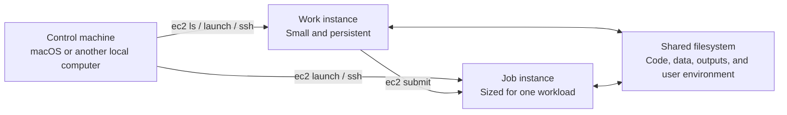
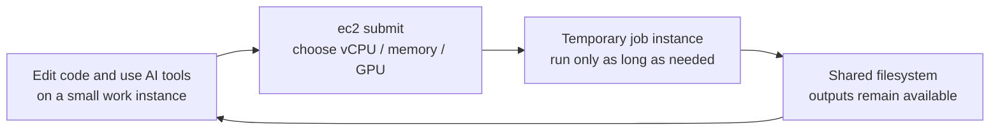

# ec2

AWS EC2 is powerful, but its command surface is large. Even simple tasks such
as finding the right instance, checking its current IP address, or connecting
over SSH often require several AWS CLI commands and knowledge of many options.
This project provides a smaller `ec2` command that turns those repetitive
operations into interactive, focused workflows.

For example:

```sh
ec2 ls       # Find instances and their current addresses
ec2 ssh      # Select an instance and connect to it
ec2 launch   # Start a configured instance from launch JSON
ec2 submit   # Run a job on a temporary instance
```

The main problem it solves is the gap between a convenient development machine
and the different machines needed for heavier work. A small, persistent work
instance can remain responsive for editing and interactive tools, while a
larger CPU-, memory-, or GPU-equipped instance can be created only when a job
needs it.

The intended workflow has three roles:


```mermaid
flowchart LR
    Control["Control machine<br/>macOS or another local computer"]
    Work["Work instance<br/>Small and persistent"]
    Job["Job instance<br/>Sized for one workload"]
    FS["Shared filesystem<br/>Code, data, outputs, and user environment"]

    Control -->|"ec2 ls / launch / ssh"| Work
    Control -->|"ec2 launch / ssh"| Job
    Work -->|"ec2 submit"| Job
    Work <--> FS
    Job <--> FS
```

- **Control machine**: the user's local machine, such as macOS. It is the
  main origin for managing EC2 instances with `ec2`.
- **Work instance**: a small, usually persistent instance such as `t3.medium`
  for editing, interactive development, and sometimes Claude or Codex.
- **Job instance**: a temporary instance selected for one workload, such as
  `c8i.large`, `r8i.4xlarge`, or `g4dn.4xlarge`. It prevents heavy work from
  exhausting the work instance and is normally terminated afterwards.

An AMI plus a shared filesystem such as EFS or FSx can make work and job
instances feel like the same environment. The `environment` configuration can
prepare the AMI, shared filesystems, launch JSON, user-data, and persistent
user environment. If an environment already exists, `ec2 new_image` can capture
an existing instance as an AMI, and `ec2 launch` can create another instance
from it.

The result is a cost-conscious workflow:


```mermaid
flowchart LR
    Edit["Edit code and use AI tools<br/>on a small work instance"]
    Submit["ec2 submit<br/>choose vCPU / memory / GPU"]
    Run["Temporary job instance<br/>run only as long as needed"]
    Output["Shared filesystem<br/>outputs remain available"]

    Edit --> Submit --> Run
    Run --> Output
    Output --> Edit
```

Use the work instance for interactive tasks and small checks. When a test,
build, analysis, conversion, or training job is expected to take several
minutes or needs substantial CPU, memory, parallelism, or GPU capacity, submit
it to a suitable job instance instead. This keeps the interactive environment
responsive and limits the cost of large instances to the time they are useful.

See [Use cases and architecture](docs/use-cases.md) for the detailed workflows,
filesystem model, job-selection guidance, and initial user-environment setup.

## Requirements

- [AWS CLI](https://aws.amazon.com/cli/)
- [Packer](https://developer.hashicorp.com/packer) for make_ami
- An AWS account, region, network, IAM permissions, and SSH/SSM access
- A shared filesystem such as EFS or FSx when sharing files between instances

## Installation

Use Homebrew:

```sh
brew install rcmdnk/rcmdnkpac/ec2
```

Alternatively, put [bin/ec2](bin/ec2) anywhere in PATH. In that case, install
the AWS CLI separately.

Or install the released command with [mise](https://mise.jdx.dev/) using its
GitHub backend:

```sh
mise use -g 'github:rcmdnk/ec2@latest'
```

Releases are created automatically when a version tag such as v0.3.1 is pushed.
The release asset is the generated bin/ec2 command. mise normally hides releases
newer than its 24-hour minimum release age. To install a newly published
version immediately, pin the version explicitly:

```sh
mise use -g 'github:rcmdnk/ec2@v0.3.1'
```

Alternatively, disable the age cutoff for this command with
`--minimum-release-age 0s`.

## Getting started

Create and edit the environment configuration:

```sh
ec2 init_environment
$EDITOR ~/.config/ec2/environment
```

Set the AWS, AMI, network, and shared filesystem settings you need. Then build
the AMI and generate the launch configuration:

```sh
ec2 make_ami --setup
```

Launch a small work instance and connect to it:

```sh
ec2 launch -t t3.medium
ec2 ssh
```

For a substantial test, build, analysis, or other CPU-, memory-, or
GPU-intensive task, keep its code, inputs, and outputs on the shared
filesystem and submit it to a suitable job instance:

```sh
cd /mnt/fsx/jobs/my-job
ec2 submit -t c8i.large --submit-current-dir 1 ./run.sh
```

ec2 submit waits for the instance, runs the script or command, and terminates
the instance after completion by default. Choose the instance type from the
workload's bottleneck: vCPUs for CPU-heavy work, memory for in-memory work,
and a compatible GPU AMI and GPU type for GPU work.

## Documentation

- [Use cases and architecture](docs/use-cases.md): roles, workflows, when to
  use submit, and initial dotfiles migration and verification
- [User guide](docs/user-guide.md): configuration, AMIs, lifecycle, connections,
  file transfer, shared filesystems, jobs, and image management
- [AI tools and ec2-operator](docs/ai-tools.md): Codex and Claude Code setup,
  prompts, and skill invocation
- [Shell completion](docs/shell-completion.md): Bash and zsh completion setup
- [Environment setup](docs/environment-setup.md): AWS prerequisites,
  permissions, filesystem setup, AMI builds, and cleanup details
- [CloudFormation examples](examples/cloudformation/README.md): Quickstart and
  Advanced environments that create the surrounding AWS resources

## Help

Run ec2 help for the complete list of subcommands and options. The installed
command is the source of truth for the current help output.

## Development

Install [prek](https://prek.j178.dev/) or [pre-commit](https://pre-commit.com/):

```sh
pip3 install prek
prek install
```

Regenerate the bundled command and run the checks:

```sh
scripts/build
prek run -a
bash scripts/verify.sh
```

bin/ec2 is generated from src/ec2, environment/commands.sh, and the files
listed in environment/assets.manifest.
