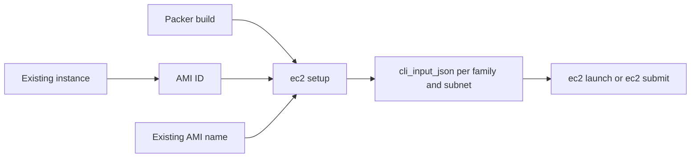

# AMI workflows and launch JSON

This guide explains how to prepare the `cli_input_json` files used by `ec2 launch` and `ec2 submit`. The files are generated by `ec2 setup` after an AMI
has been selected or created.

There are three normal ways to obtain the AMI:



AMI creation and launch JSON generation are separate operations. `ec2 setup`
also prepares configured filesystems, user-data, and the client configuration,
so it is the common final step for all three workflows.

## Common preparation

Before running `ec2 setup`, prepare the following:

1. Create or select the AWS subnet(s) where the instances will run.
1. Create an EC2 key pair and set `EC2_KEY_NAME`.
1. Set `AWS_REGION` and the subnet settings in the environment file.
1. Enable the AMI families to generate, such as `CPU` or `GPU`.
1. Configure EFS, FSx, S3 Files, or io2 settings if the launched instances
   need shared storage.
1. Set the instance type for each family with
   `<FAMILY>_BUILD_INSTANCE_TYPE`. This value is also written to that family's
   launch JSON.

Initialize the environment file when needed:

```sh
ec2 init_environment
$EDITOR ~/.config/ec2/environment
```

The detailed AWS prerequisites and permission requirements are described in
[Environment setup](environment-setup.md).

## 1. Build an AMI with `make_ami`

Use this workflow for reproducible images built from an upstream source AMI.

Set the output name and source settings in the environment file:

```bash
CPU_ENABLED=1
CPU_OUTPUT_AMI_NAME="my-project-cpu-20260925"
CPU_SOURCE_AMI_NAME_FILTER="al2023-ami-*-x86_64"
CPU_SOURCE_AMI_OWNER="amazon"
CPU_BUILD_INSTANCE_TYPE="c8i.large"
```

Build the AMI and generate launch JSON in one command:

```sh
ec2 make_ami --setup
```

Or run the steps separately when you want to inspect the build first:

```sh
ec2 make_ami
ec2 setup
```

The setup step resolves the newly built self-owned AMI, prepares the configured
filesystems, and writes one JSON file per enabled AMI family and subnet.

## 2. Create an AMI from an existing instance with `new_image`

Use this workflow when a work instance has been configured manually and should
become a reusable image.

To create only the AMI:

```sh
ec2 --instance-id i-0123456789abcdef0 \
  --image-name my-project-cpu-manual \
  --wait new_image
```

Then put the resulting AMI ID in the environment file and run setup:

```bash
CPU_AMI_ID="ami-0123456789abcdef0"
```

```sh
ec2 setup
```

To create the AMI and generate the CPU launch JSON in one operation, specify
the family:

```sh
ec2 --instance-id i-0123456789abcdef0 \
  --image-name my-project-cpu-manual \
  --ami-family CPU --wait --setup new_image
```

`new_image` reboots the source instance by default so the filesystem snapshot
is consistent. `--no-reboot` avoids the reboot but can produce an inconsistent
AMI:

```sh
ec2 --instance-id i-0123456789abcdef0 \
  --image-name my-project-cpu-manual \
  --ami-family CPU --wait --no-reboot --setup new_image
```

`--setup` requires `--wait`, because launch JSON must not be generated until
the new AMI is available.

## 3. Use an existing AMI by name

Use this workflow for an AMI created outside the current Packer workdir, or
for an AMI that is periodically replaced under a stable name.

For an AMI owned by the current account:

```bash
CPU_AMI_NAME="my-shared-cpu-image"
CPU_AMI_OWNER="self"
```

For an AMI shared by another account:

```bash
CPU_AMI_NAME="my-shared-cpu-image"
CPU_AMI_OWNER="123456789012"
```

Then generate the launch JSON:

```sh
ec2 setup
```

When `CPU_AMI_NAME` is not set, the existing `CPU_OUTPUT_AMI_NAME` setting is
used as a self-owned AMI name for backward compatibility. If an exact AMI ID
is known, prefer `CPU_AMI_ID`; it is unambiguous and works for self-owned,
shared, and Marketplace AMIs.

For a one-off setup without changing the environment file:

```sh
ec2 setup --ami-family CPU --ami-id ami-0123456789abcdef0
```

## Generated files

With the default workdir, `ec2 setup` creates:

```text
~/.config/ec2/work/ec2/
├── cli_input_json/
│   ├── my-project-cpu-subnet-a.json
│   └── my-project-cpu-subnet-b.json
├── config
├── user_data.sh
└── user_data.sh.gz
```

Each launch JSON contains the resolved `ImageId`, the family instance type,
the key pair, the subnet, the security groups, and the instance profile when
configured. A separate JSON is written for each subnet so capacity and
availability-zone choices can be handled independently.

The generated `config` maps family names to JSON groups. When it is installed
(the default), use the family group directly:

```sh
ec2 launch --cli-input-json-group cpu
ec2 submit --cli-input-json-group cpu -- python /mnt/fsx/jobs/run.sh
```

Use `--install-config 0` when you want to inspect or test the generated files
without replacing `~/.config/ec2/config`:

```sh
ec2 setup --install-config 0
ec2 launch --cli-input-json-directory ~/.config/ec2/work/ec2/cli_input_json
```

Run `ec2 setup` again whenever the AMI, subnet list, filesystem settings,
instance type, or user-data settings change. Existing generated launch JSON is
replaced with the current resolved configuration.
